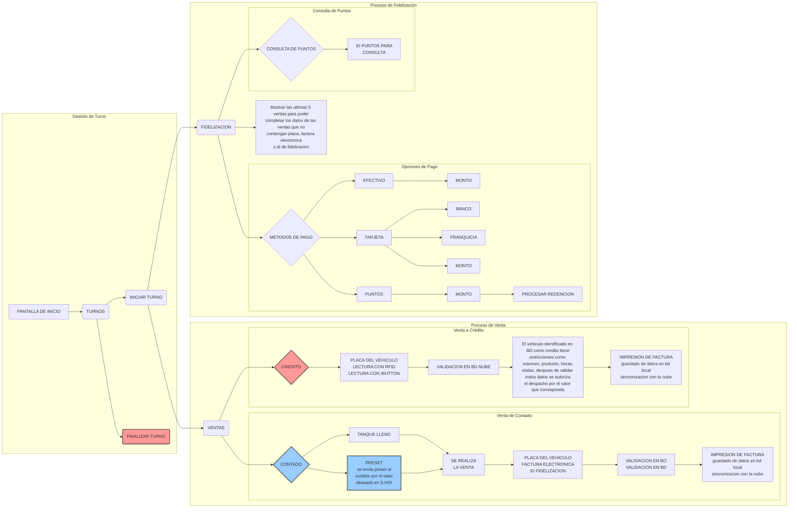

# Diagrama de flujo inicial

```mermaid
graph LR
    subgraph "Gestión de Turno"
        A["PANTALLA DE INICIO"] --> B(TURNOS)
        B --> C("INICIAR TURNO")
        B --> D("FINALIZAR TURNO")
    end

    C --> E(VENTAS)
    C --> F(FIDELIZACION)

    subgraph "Proceso de Venta"
        E --> G{CONTADO}
        E --> H{CREDITO}

        subgraph "Venta de Contado"
            G --> I["TANQUE LLENO"] --> K["SE REALIZA<br>LA VENTA"]
            G --> J["PRESET<br>se envia preset al<br>surtidor por el valor<br>deseado en S.VOI"] --> K
            K --> L["PLACA DEL VEHICULO<br>FACTURA ELECTRONICA<br>ID FIDELIZACION"]
            L --> M["VALIDACION EN BO<br>VALIDACION EN BD"]
            M --> N["IMPRESION DE FACTURA<br>guardado de datos en bd local<br>sincronizacion con la nube"]
        end

        subgraph "Venta a Crédito"
            H --> O["PLACA DEL VEHICULO<br>LECTURA CON RFID<br>LECTURA CON IBUTTON"]
            O --> P["VALIDACION EN BD NUBE"]
            P --> Q["El vehiculo identificado en BD como credito tiene<br>restricciones como volumen, producto, horas,<br>visitas, despues de validar estos datos se autoriza<br>el despacho por el valor que corresponda"]
            Q --> R["IMPRESION DE FACTURA<br>guardado de datos en bd local<br>sincronizacion con la nube"]
        end
    end

    subgraph "Proceso de Fidelización"
        F --> S["Mostrar las ultimas 5 ventas para poder<br>completar los datos de las ventas que no<br>contengan placa, factura electronica<br>o id de fidelizacion"]
        F --> T{METODOS DE PAGO}
        F --> U{CONSULTA DE PUNTOS}

        subgraph "Opciones de Pago"
            T --> V["EFECTIVO"] --> V_M["MONTO"]
            T --> W["TARJETA"]
            W --> W_B["BANCO"]
            W --> W_F["FRANQUICIA"]
            W --> W_M["MONTO"]
            T --> X["PUNTOS"] --> X_M["MONTO"] --> X_P["PROCESAR REDENCION"]
        end

        subgraph "Consulta de Puntos"
            U --> Y["ID PUNTOS PARA<br>CONSULTA"]
        end
    end

    %% Styles to match original diagram colors
    style D fill:#f99,stroke:#333,stroke-width:2px
    style G fill:#9cf,stroke:#333,stroke-width:2px
    style J fill:#9cf,stroke:#333,stroke-width:2px
    style H fill:#f99,stroke:#333,stroke-width:2px
```
