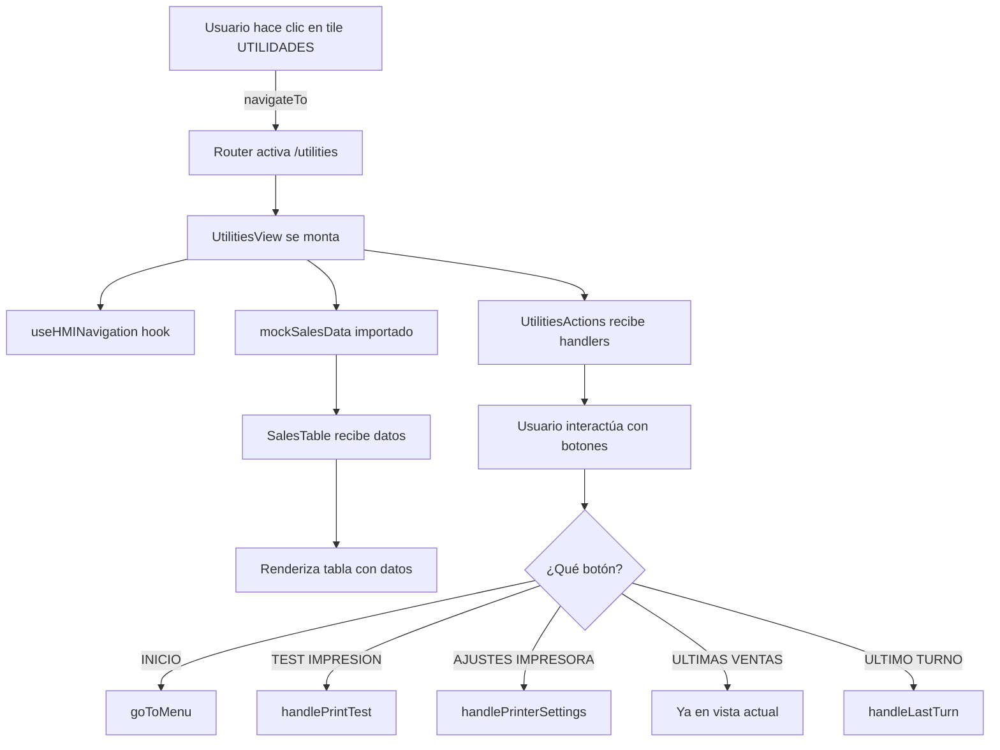

# Arquitectura del Módulo de Utilidades

**Fecha:** 08/10/2025 22:32  
**Módulo:** Utilities  
**Versión:** 1.0

---

## 📊 Diagrama de Arquitectura

```
┌─────────────────────────────────────────────────────────────────┐
│                        MAIN MENU VIEW                            │
│  ┌──────────┐  ┌──────────┐  ┌──────────┐  ┌──────────┐       │
│  │ CONTADO  │  │ CREDITO  │  │FIDELIZ.  │  │UTILIDADES│       │
│  └──────────┘  └──────────┘  └──────────┘  └────┬─────┘       │
└─────────────────────────────────────────────────┼──────────────┘
                                                    │
                                          navigateTo("utilities")
                                                    │
                                                    ▼
┌─────────────────────────────────────────────────────────────────┐
│                      UTILITIES VIEW                              │
│  ┌───────────────────────────────────────────────────────────┐ │
│  │                    HEADER                                  │ │
│  │  [UTILIDADES] [⚙️ Settings Icon] [← Atrás]               │ │
│  └───────────────────────────────────────────────────────────┘ │
│                                                                  │
│  ┌───────────────────────────────────────────────────────────┐ │
│  │              SALES TABLE COMPONENT                        │ │
│  │  ┌────┬─────────┬─────────┬───────┬─────────┬──────┬────┐│ │
│  │  │ #FE│ID PUNTOS│ID PROMO │ PLACA │PRODUCTO │DINERO│VOL ││ │
│  │  ├────┼─────────┼─────────┼───────┼─────────┼──────┼────┤│ │
│  │  │...│  ...    │  ...    │  ...  │   ...   │ ...  │... ││ │
│  │  └────┴─────────┴─────────┴───────┴─────────┴──────┴────┘│ │
│  └───────────────────────────────────────────────────────────┘ │
│                                                                  │
│  ┌───────────────────────────────────────────────────────────┐ │
│  │            UTILITIES ACTIONS COMPONENT                    │ │
│  │  ┌────────┐ ┌────────┐ ┌────────┐ ┌────────┐ ┌────────┐ │ │
│  │  │ INICIO │ │  TEST  │ │AJUSTES │ │ULTIMAS │ │ ULTIMO │ │ │
│  │  │        │ │  IMPR. │ │ IMPR.  │ │ VENTAS │ │ TURNO  │ │ │
│  │  └────────┘ └────────┘ └────────┘ └────────┘ └────────┘ │ │
│  └───────────────────────────────────────────────────────────┘ │
└─────────────────────────────────────────────────────────────────┘
```

---

## 🗂️ Estructura de Componentes

```
utilities-view.tsx (Principal)
    │
    ├─> HMIContainer (Layout wrapper)
    │
    ├─> Header Section
    │   ├─> Título "UTILIDADES"
    │   ├─> Icono Settings
    │   └─> Botón "Atrás" (useHMINavigation)
    │
    ├─> SalesTable (Componente hijo)
    │   ├─> Props: salesData (SaleRecord[])
    │   └─> Renderiza tabla con 7 columnas
    │
    └─> UtilitiesActions (Componente hijo)
        ├─> Props: onActionClick (handler)
        └─> Renderiza 5 botones de acción
```

---

## 🔄 Flujo de Datos



---

## 📦 Dependencias entre Módulos

```
utilities/
    ├─ utilities-view.tsx
    │   ├─ IMPORTA: sales-table.tsx
    │   ├─ IMPORTA: utilities-actions.tsx
    │   ├─ IMPORTA: types.ts
    │   ├─ IMPORTA: mock-data.ts
    │   └─ USA: @/lib/hooks/use-hmi-navigation
    │
    ├─ sales-table.tsx
    │   └─ IMPORTA: types.ts
    │
    ├─ utilities-actions.tsx
    │   ├─ IMPORTA: types.ts
    │   └─ USA: lucide-react icons
    │
    ├─ types.ts
    │   └─ Define: SaleRecord, UtilityAction
    │
    └─ mock-data.ts
        ├─ IMPORTA: types.ts
        └─ Exporta: mockSalesData[]
```

---

## 🛣️ Integración con Router

### Antes de la implementación:
```tsx
// routes.tsx
export const routes: RouteObject[] = [
  {
    path: "/",
    element: <HMIRoute />,
    children: [
      // ... otras rutas
      {
        path: "loyalty",
        element: <PointsView />,
      },
      {
        path: "close-turn",
        element: <CloseTurnViewComponent />,
      },
    ],
  },
];
```

### Después de la implementación:
```tsx
// routes.tsx
import { UtilitiesView } from "@/components/modules/utilities/utilities-view";

export const routes: RouteObject[] = [
  {
    path: "/",
    element: <HMIRoute />,
    children: [
      // ... otras rutas
      {
        path: "loyalty",
        element: <PointsView />,
      },
      {
        path: "utilities",  // ⬅️ NUEVA RUTA
        element: <UtilitiesView />,
      },
      {
        path: "close-turn",
        element: <CloseTurnViewComponent />,
      },
    ],
  },
];
```

---

## 🔗 Integración con Navegación

### Actualización de use-hmi-navigation.ts

```typescript
// ANTES
export function useHMINavigation() {
  const navigate = useNavigate();

  return {
    navigateTo: (viewId: string) => {
      navigate(`/${viewId}`);
    },
    // ... otros métodos
    goToCloseTurn: () => {
      navigate("/close-turn");
    },
  };
}

// DESPUÉS
export function useHMINavigation() {
  const navigate = useNavigate();

  return {
    navigateTo: (viewId: string) => {
      navigate(`/${viewId}`);
    },
    // ... otros métodos
    goToCloseTurn: () => {
      navigate("/close-turn");
    },
    goToUtilities: () => {  // ⬅️ NUEVO MÉTODO
      navigate("/utilities");
    },
  };
}
```

### Actualización de menu-data.tsx

```typescript
// ANTES
{
  key: "utilidades",
  title: "UTILIDADES",
  icon: <Settings size={64} />,
  action: undefined, // ⬅️ Sin acción
},

// DESPUÉS
{
  key: "utilidades",
  title: "UTILIDADES",
  icon: <Settings size={64} />,
  action: () => navigateTo("utilities"), // ⬅️ Acción conectada
},
```

---

## 🎨 Jerarquía de Estilos

```
UtilitiesView
  └─ className: "min-h-screen bg-gradient-to-br from-blue-900 to-blue-600"
      │
      ├─ Header
      │   └─ className: "bg-blue-800 text-white px-6 py-4"
      │
      ├─ SalesTable
      │   └─ className: "bg-white rounded-lg shadow-lg p-4 mb-6"
      │       └─ Table
      │           └─ className: "w-full border-collapse"
      │
      └─ UtilitiesActions
          └─ className: "grid grid-cols-5 gap-4 max-w-6xl mx-auto"
              └─ Button (x5)
                  └─ className: "px-6 py-4 rounded-lg font-semibold text-white ..."
```

---

## 🧩 Interfaces y Tipos

### types.ts

```typescript
/**
 * Registro de una venta en el sistema
 */
export interface SaleRecord {
  /** Número de factura electrónica */
  fe: string;
  
  /** Identificador de programa de puntos */
  idPuntos: string;
  
  /** Identificador de promoción aplicada */
  idPromo: string;
  
  /** Placa del vehículo */
  placa: string;
  
  /** Nombre del producto vendido */
  producto: string;
  
  /** Monto total en pesos colombianos */
  dinero: number;
  
  /** Volumen en litros o galones */
  volumen: number;
}

/**
 * Definición de una acción/botón en utilidades
 */
export interface UtilityAction {
  /** Identificador único de la acción */
  key: string;
  
  /** Etiqueta a mostrar en el botón */
  label: string;
  
  /** Color del botón (clase TailwindCSS) */
  color: string;
  
  /** Icono de lucide-react */
  icon: React.ReactNode;
  
  /** Función a ejecutar al hacer clic (opcional) */
  action?: () => void;
  
  /** Si es la acción activa/seleccionada */
  isActive?: boolean;
}

/**
 * Props del componente SalesTable
 */
export interface SalesTableProps {
  /** Array de registros de ventas */
  salesData: SaleRecord[];
}

/**
 * Props del componente UtilitiesActions
 */
export interface UtilitiesActionsProps {
  /** Handler para clicks en botones de acción */
  onActionClick: (actionKey: string) => void;
}
```

---

## 🔐 Seguridad y Validaciones

### Validaciones Implementadas

1. **Navegación Protegida**
   - La ruta `/utilities` está dentro de `HMIRoute`
   - Requiere autenticación según flujo HMI

2. **Datos Mock**
   - Solo para desarrollo inicial
   - Posteriormente se conectará con API real

3. **Handlers Defensivos**
   - Validación de existencia de callbacks antes de ejecutar
   - Manejo de estados loading/error en futuras integraciones

---

## 🚀 Optimizaciones Futuras

### Fase 1 (Actual): Implementación Base
- ✅ Componentes estáticos con datos mock
- ✅ Navegación funcional
- ✅ UI según diseño

### Fase 2: Integración con Backend
- [ ] Conectar tabla con API de ventas reales
- [ ] Implementar paginación en tabla
- [ ] Filtros y búsqueda en ventas

### Fase 3: Funcionalidades Avanzadas
- [ ] Test de impresión real
- [ ] Configuración de impresora persistente
- [ ] Vista de último turno con datos reales
- [ ] Export de datos (CSV/PDF)

### Fase 4: Mejoras UX
- [ ] Loading states
- [ ] Error boundaries
- [ ] Skeleton loaders
- [ ] Animaciones de transición

---

## 📈 Métricas de Éxito

### Técnicas
- [ ] 100% TypeScript sin `any`
- [ ] 0 errores en consola
- [ ] Tiempo de carga < 200ms
- [ ] Bundle size < 50KB adicionales

### Funcionales
- [ ] Usuario puede navegar al módulo desde menú
- [ ] Tabla renderiza correctamente 5+ registros
- [ ] Todos los botones tienen hover effects
- [ ] Botón "REINICIAR" NO está presente
- [ ] Navegación de retorno funciona correctamente

---

## 🐛 Consideraciones de Debugging

### Puntos de Verificación

1. **Router**
   ```
   ✓ ¿La ruta está registrada en routes.tsx?
   ✓ ¿El import del componente es correcto?
   ✓ ¿El path coincide con navigateTo("utilities")?
   ```

2. **Navegación**
   ```
   ✓ ¿menu-data.tsx tiene la acción definida?
   ✓ ¿useHMINavigation se importa correctamente?
   ✓ ¿El método navigateTo recibe "utilities"?
   ```

3. **Renderizado**
   ```
   ✓ ¿SalesTable recibe props correctamente?
   ✓ ¿mockSalesData tiene el formato correcto?
   ✓ ¿Los estilos TailwindCSS se aplican?
   ```

---

## 📚 Referencias

- **Diseño Base:** `resources/layouts-finales--2025-10-01/8- Nexus POS utilidades.png`
- **Patrón de Referencia:** `src/components/modules/loyalty/points-view.tsx`
- **Router:** `src/router/routes.tsx`
- **Navegación:** `src/lib/hooks/use-hmi-navigation.ts`
- **Reglas del Proyecto:** `.windsurf/rules/filenames-rules.md`

---

*Documento de arquitectura generado por Cascade AI*
