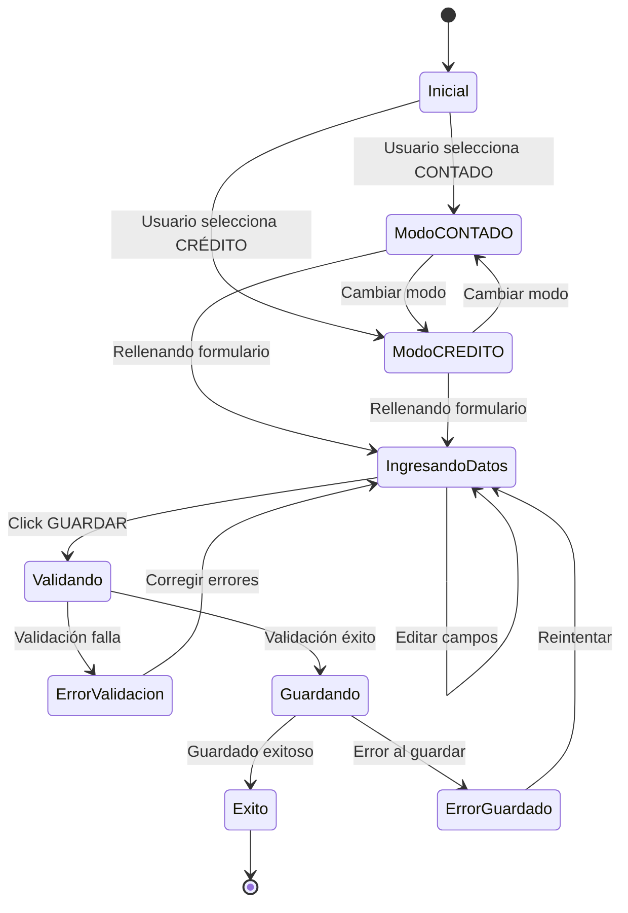

# Payment View - Arquitectura Completa

## Documento de Diseño Arquitectónico
**Versión:** 1.0  
**Fecha:** 2025-10-07  
**Módulo:** `payment-view`  
**Autor:** Kilo Code  

---

## 1. VISIÓN GENERAL

### 1.1 Propósito
El componente `payment-view` es una vista HMI optimizada para pantallas táctiles que permite gestionar el proceso completo de cobro en ventas de combustible, soportando dos modalidades:
- **CONTADO**: Pago inmediato con múltiples métodos (tarjeta, efectivo, otro)
- **CRÉDITO**: Pago diferido asociado a cuenta cliente

### 1.2 Contexto del Sistema
Este componente se integra en el flujo de ventas del sistema Nexus POS, siguiendo el patrón arquitectónico establecido por [`cash-sale`](../src/components/modules/sales/cash-sale) y utilizando la infraestructura de navegación HMI existente.

### 1.3 Decisiones de Diseño Principales

#### ✅ Separación de Responsabilidades
- **View**: Orquestación y layout principal
- **Components**: UI reutilizable y específica del dominio
- **Hooks**: Lógica de negocio y estado
- **Types**: Contratos de datos y validaciones

#### ✅ Composición sobre Herencia
Reutilización de componentes atómicos existentes:
- [`TouchInput`](../src/components/shared/touch-input) para campos de texto
- [`TouchSelect`](../src/components/shared/touch-select) para selección de opciones
- Extensión de `TouchSelect` para el selector de bancos con paginación

#### ✅ Estado Local con Hooks Personalizados
Encapsulación de lógica compleja en hooks custom para:
- Gestión de formulario multi-modo
- Validación condicional por modo
- Distribución de montos entre métodos de pago
- Cálculo de totales y cambios

---

## 2. ESTRUCTURA DE ARCHIVOS

```
src/components/modules/sales/payment-view/
├── payment-view.tsx                    # Vista principal - orquestación
├── components/                         # Componentes UI específicos
│   ├── mode-selector.tsx              # Botones CONTADO/CRÉDITO
│   ├── identification-section.tsx     # Campos PLACA, ID FACTURA, ID PUNTOS
│   ├── coupon-checkbox.tsx            # Checkbox con campo condicional
│   ├── payment-methods-grid.tsx       # Grid de 3 métodos de pago
│   ├── payment-method-card.tsx        # Card individual de método de pago
│   ├── bank-selector.tsx              # Selector de bancos (extendido de TouchSelect)
│   ├── save-button.tsx                # Botón GUARDAR con icono
│   └── side-navigation.tsx            # Tiles laterales de navegación
├── hooks/                             # Lógica de negocio
│   ├── use-payment-form.ts            # Estado principal del formulario
│   ├── use-payment-validation.ts      # Validaciones por modo
│   ├── use-payment-methods.ts         # Gestión de métodos múltiples
│   └── use-amount-distribution.ts     # Distribución y cálculo de montos
├── types/                             # Definiciones de tipos
│   ├── index.ts                       # Exportaciones principales
│   ├── payment-form.types.ts          # FormData y relacionados
│   ├── payment-method.types.ts        # Tipos de métodos de pago
│   └── bank-options.ts                # Lista de bancos colombianos
└── README.md                          # Documentación del módulo
```

### 2.1 Responsabilidades por Archivo

#### **payment-view.tsx**
- Componente raíz del módulo
- Integración con [`HMIContainer`](../src/components/layouts/hmi-container.tsx)
- Orquestación de hooks y componentes hijos
- Manejo de navegación con [`useHMINavigation`](../src/lib/hooks/use-hmi-navigation.ts)
- Coordinación del flujo de guardado

#### **components/mode-selector.tsx**
- Renderiza botones CONTADO (verde) y CRÉDITO (rojo)
- Maneja cambio de modo y reseteo de estado asociado
- Feedback visual del modo activo

#### **components/identification-section.tsx**
- Agrupa campos de identificación
- Renderizado condicional según modo
- Integración con `TouchInput` para PLACA, ID FACTURA, ID PUNTOS

#### **components/coupon-checkbox.tsx**
- Checkbox CUPÓN con estado
- Campo condicional ID PROMOCION (solo si CUPÓN activo)
- Validación obligatoria de ID PROMOCION cuando activo

#### **components/payment-methods-grid.tsx**
- Grid de 3 columnas para métodos de pago
- Gestiona habilitación/deshabilitación de métodos
- Distribución automática de montos
- Solo visible en modo CONTADO

#### **components/payment-method-card.tsx**
- Card individual para cada método (TARJETA, EFECTIVO, OTRO)
- Campos específicos por tipo de método
- Integración con `bank-selector` para método TARJETA
- Visual feedback de método activo/inactivo

#### **components/bank-selector.tsx**
- Extiende funcionalidad de `TouchSelect`
- Grid 3×4 con paginación para bancos
- Lista completa de bancos colombianos
- Opcional: iconos/logos de bancos

#### **components/save-button.tsx**
- Botón grande tipo HMI con icono de guardar
- Estado deshabilitado según validaciones
- Feedback visual de guardando/completado

#### **components/side-navigation.tsx**
- Tiles laterales: VENTAS, IMPRIMIR, INICIO
- Reutiliza patrón de `SideTile` de cash-sale
- Navegación contextual

---

## 3. TIPOS TYPESCRIPT

### 3.1 Archivo: `types/payment-form.types.ts`

```typescript
/**
 * Modos de pago disponibles
 */
export type PaymentMode = 'CONTADO' | 'CREDITO';

/**
 * Datos del formulario de pago
 * Incluye todos los campos necesarios para ambos modos
 */
export interface PaymentFormData {
  // Modo de pago
  mode: PaymentMode;
  
  // Identificación (obligatorio en ambos modos)
  placa: string;
  
  // Identificación adicional (opcional en CONTADO, no editable en CRÉDITO)
  idFacturaElectronica: string;
  idPuntosColombia: string;
  
  // Cupón (solo CONTADO)
  cuponEnabled: boolean;
  idPromocion: string; // obligatorio si cuponEnabled
  
  // Métodos de pago (solo CONTADO)
  paymentMethods: PaymentMethodData[];
  
  // Total de la venta (viene del contexto previo)
  totalVenta: number;
  
  // Metadatos
  timestamp: Date;
  operatorId: string;
}

/**
 * Estado de validación del formulario
 */
export interface PaymentFormValidation {
  isValid: boolean;
  errors: PaymentFormErrors;
}

/**
 * Errores de validación por campo
 */
export interface PaymentFormErrors {
  placa?: string;
  idPromocion?: string;
  paymentMethods?: string;
  general?: string;
}

/**
 * Configuración de validación por modo
 */
export interface ModeValidationRules {
  requiredFields: (keyof PaymentFormData)[];
  validatePaymentMethods: boolean;
  validateCoupon: boolean;
}
```

### 3.2 Archivo: `types/payment-method.types.ts`

```typescript
/**
 * Tipos de métodos de pago disponibles
 */
export type PaymentMethodType = 'TARJETA' | 'EFECTIVO' | 'OTRO';

/**
 * Estado de un método de pago individual
 */
export interface PaymentMethodData {
  id: string; // UUID para identificar el método
  type: PaymentMethodType;
  enabled: boolean;
  monto: number;
  
  // Campos específicos para TARJETA
  banco?: string;
  franquicia?: string;
  
  // Orden de visualización
  order: number;
}

/**
 * Configuración de método de pago
 */
export interface PaymentMethodConfig {
  type: PaymentMethodType;
  label: string;
  icon: React.ReactNode;
  defaultEnabled: boolean;
  fields: PaymentMethodField[];
}

/**
 * Campo de entrada para método de pago
 */
export interface PaymentMethodField {
  name: string;
  label: string;
  type: 'text' | 'select' | 'number';
  required: boolean;
  placeholder?: string;
  options?: Array<{ value: string; label: string }>;
}

/**
 * Resultado de distribución de montos
 */
export interface AmountDistribution {
  totalAsignado: number;
  restante: number;
  isComplete: boolean;
  distribution: Map<string, number>; // methodId -> monto
}
```

### 3.3 Archivo: `types/bank-options.ts`

```typescript
import type { TouchSelectOption } from '@/components/shared/touch-select';

/**
 * Lista completa de bancos principales en Colombia
 * Organizada alfabéticamente para grid 3×4 con paginación
 */
export const colombianBanks: TouchSelectOption[] = [
  {
    value: 'BANCOLOMBIA',
    label: 'Bancolombia',
    icon: '🏦',
    description: 'Bancolombia S.A.'
  },
  {
    value: 'BANCO_BOGOTA',
    label: 'Banco de Bogotá',
    icon: '🏦',
    description: 'Banco de Bogotá'
  },
  {
    value: 'DAVIVIENDA',
    label: 'Davivienda',
    icon: '🏦',
    description: 'Banco Davivienda'
  },
  {
    value: 'BBVA',
    label: 'BBVA',
    icon: '🏦',
    description: 'BBVA Colombia'
  },
  {
    value: 'BANCO_OCCIDENTE',
    label: 'Banco de Occidente',
    icon: '🏦',
    description: 'Banco de Occidente'
  },
  {
    value: 'BANCO_POPULAR',
    label: 'Banco Popular',
    icon: '🏦',
    description: 'Banco Popular'
  },
  {
    value: 'SCOTIABANK',
    label: 'Scotiabank Colpatria',
    icon: '🏦',
    description: 'Scotiabank Colpatria'
  },
  {
    value: 'ITAU',
    label: 'Itaú',
    icon: '🏦',
    description: 'Banco Itaú'
  },
  {
    value: 'BANCO_GNB',
    label: 'GNB Sudameris',
    icon: '🏦',
    description: 'Banco GNB Sudameris'
  },
  {
    value: 'BANCO_AV_VILLAS',
    label: 'AV Villas',
    icon: '🏦',
    description: 'Banco AV Villas'
  },
  {
    value: 'BANCO_CAJA_SOCIAL',
    label: 'Caja Social',
    icon: '🏦',
    description: 'Banco Caja Social BCSC'
  },
  {
    value: 'BANCO_AGRARIO',
    label: 'Banco Agrario',
    icon: '🌾',
    description: 'Banco Agrario de Colombia'
  },
  {
    value: 'BANCO_COOPERATIVO',
    label: 'Coopcentral',
    icon: '🏦',
    description: 'Banco Cooperativo Coopcentral'
  },
  {
    value: 'BANCO_FALABELLA',
    label: 'Falabella',
    icon: '🏦',
    description: 'Banco Falabella'
  },
  {
    value: 'BANCO_PICHINCHA',
    label: 'Pichincha',
    icon: '🏦',
    description: 'Banco Pichincha'
  },
  {
    value: 'BANCAMIA',
    label: 'Bancamía',
    icon: '🏦',
    description: 'Bancamía S.A.'
  }
];

/**
 * Configuración de paginación para grid de bancos
 */
export const BANK_GRID_CONFIG = {
  columns: 3,
  rows: 4,
  itemsPerPage: 12,
  totalPages: Math.ceil(colombianBanks.length / 12)
} as const;

/**
 * Franquicias de tarjetas disponibles
 */
export const cardFranchises: TouchSelectOption[] = [
  {
    value: 'VISA',
    label: 'Visa',
    icon: '💳'
  },
  {
    value: 'MASTERCARD',
    label: 'Mastercard',
    icon: '💳'
  },
  {
    value: 'AMEX',
    label: 'American Express',
    icon: '💳'
  },
  {
    value: 'DINERS',
    label: 'Diners Club',
    icon: '💳'
  }
];
```

---

## 4. HOOKS PERSONALIZADOS

### 4.1 Archivo: `hooks/use-payment-form.ts`

**Responsabilidad:** Estado principal del formulario y orquestación

```typescript
/**
 * Hook principal para gestión del formulario de pago
 * 
 * Encapsula:
 * - Estado completo del formulario
 * - Cambio de modo CONTADO/CRÉDITO
 * - Reseteo selectivo de campos según modo
 * - Integración con hooks de validación y métodos de pago
 * 
 * @param initialTotal - Total de la venta desde contexto previo
 * @param onSave - Callback para guardar el pago
 */
export function usePaymentForm(
  initialTotal: number,
  onSave: (data: PaymentFormData) => Promise<void>
): UsePaymentFormReturn;

interface UsePaymentFormReturn {
  // Estado
  formData: PaymentFormData;
  mode: PaymentMode;
  isSaving: boolean;
  
  // Acciones
  setMode: (mode: PaymentMode) => void;
  updateField: <K extends keyof PaymentFormData>(
    field: K,
    value: PaymentFormData[K]
  ) => void;
  toggleCoupon: () => void;
  handleSave: () => Promise<void>;
  reset: () => void;
  
  // Validación (del hook de validación)
  validation: PaymentFormValidation;
  
  // Métodos de pago (del hook de métodos)
  paymentMethods: PaymentMethodData[];
  updatePaymentMethod: (id: string, updates: Partial<PaymentMethodData>) => void;
  enablePaymentMethod: (id: string) => void;
  
  // Distribución de montos (del hook de distribución)
  distribution: AmountDistribution;
}
```

**Lógica Clave:**
- Al cambiar de CONTADO → CRÉDITO: resetear `paymentMethods`, `cuponEnabled`, `idPromocion`
- Al cambiar de CRÉDITO → CONTADO: inicializar `paymentMethods` con valores por defecto
- Mantener `placa` y otros campos de identificación entre cambios de modo

### 4.2 Archivo: `hooks/use-payment-validation.ts`

**Responsabilidad:** Validación condicional según modo

```typescript
/**
 * Hook para validación del formulario según modo activo
 * 
 * Reglas de validación:
 * 
 * MODO CONTADO:
 * - PLACA: obligatorio, formato alfanumérico
 * - ID PROMOCION: obligatorio solo si cuponEnabled = true
 * - Métodos de pago: al menos uno activo, suma = totalVenta
 * - Campos TARJETA: si método activo, BANCO y FRANQUICIA obligatorios
 * 
 * MODO CRÉDITO:
 * - PLACA: obligatorio, formato alfanumérico
 * - No validar métodos de pago ni cupón
 * 
 * @param formData - Datos del formulario
 * @param mode - Modo activo
 */
export function usePaymentValidation(
  formData: PaymentFormData,
  mode: PaymentMode
): PaymentFormValidation;
```

**Validaciones Específicas:**

```typescript
// Validación de PLACA (ambos modos)
- Longitud: 6 caracteres
- Formato: 3 letras + 3 números (ej: ABC123)
- No espacios ni caracteres especiales

// Validación de ID PROMOCION (solo CONTADO con cupón)
- Obligatorio si cuponEnabled = true
- Formato: numérico, mínimo 8 dígitos

// Validación de métodos de pago (solo CONTADO)
- Al menos un método con enabled = true
- Suma de montos = totalVenta
- Si TARJETA activa: banco y franquicia obligatorios
- Montos > 0 para métodos activos
```

### 4.3 Archivo: `hooks/use-payment-methods.ts`

**Responsabilidad:** Gestión de múltiples métodos de pago

```typescript
/**
 * Hook para gestionar el estado de múltiples métodos de pago
 * 
 * Funcionalidad:
 * - Inicializa 3 métodos: TARJETA, EFECTIVO, OTRO
 * - Primer método con monto = totalVenta, otros deshabilitados
 * - Al modificar monto del primer método → habilitar otros
 * - Actualización reactiva de montos y estados
 * 
 * @param totalVenta - Total a distribuir
 */
export function usePaymentMethods(
  totalVenta: number
): UsePaymentMethodsReturn;

interface UsePaymentMethodsReturn {
  methods: PaymentMethodData[];
  updateMethod: (id: string, updates: Partial<PaymentMethodData>) => void;
  enableMethod: (id: string) => void;
  disableMethod: (id: string) => void;
  resetMethods: () => void;
}
```

**Lógica de Habilitación:**

```typescript
// Estado inicial
methods[0] (TARJETA):  enabled: true,  monto: totalVenta
methods[1] (EFECTIVO): enabled: false, monto: 0
methods[2] (OTRO):     enabled: false, monto: 0

// Al modificar monto de methods[0] con valor < totalVenta:
→ Habilitar methods[1] y methods[2]
→ Calcular distribución automática o manual

// Si usuario activa manualmente un método:
→ enabled: true
→ monto: se calcula en distribución
```

### 4.4 Archivo: `hooks/use-amount-distribution.ts`

**Responsabilidad:** Cálculo y distribución de montos

```typescript
/**
 * Hook para calcular distribución de montos entre métodos
 * 
 * Estrategia:
 * 1. Sumar montos de todos los métodos activos
 * 2. Calcular restante = totalVenta - totalAsignado
 * 3. Si solo un método activo → asignar total a ese método
 * 4. Si múltiples métodos → distribuir proporcionalmente
 * 5. Validar que suma exacta = totalVenta antes de guardar
 * 
 * @param methods - Lista de métodos de pago
 * @param totalVenta - Total a distribuir
 */
export function useAmountDistribution(
  methods: PaymentMethodData[],
  totalVenta: number
): AmountDistribution;

interface AmountDistribution {
  totalAsignado: number;
  restante: number;
  isComplete: boolean;
  distribution: Map<string, number>;
  
  // Helpers
  canDistribute: boolean;
  needsAdjustment: boolean;
  suggestedDistribution: Map<string, number>;
}
```

**Algoritmo de Distribución:**

```typescript
// Caso 1: Un solo método activo
if (activeMethods.length === 1) {
  distribution.set(methodId, totalVenta);
}

// Caso 2: Múltiples métodos activos
// Usuario asigna montos manualmente
// Hook solo valida y calcula restante

// Caso 3: Auto-distribución (opcional)
// Distribuir equitativamente entre métodos activos
const montoPorMetodo = totalVenta / activeMethods.length;
activeMethods.forEach(m => {
  distribution.set(m.id, Math.round(montoPorMetodo));
});

// Ajustar diferencias de redondeo al primer método
const diff = totalVenta - Array.from(distribution.values()).reduce((a, b) => a + b, 0);
if (diff !== 0) {
  const firstMethodId = activeMethods[0].id;
  distribution.set(firstMethodId, distribution.get(firstMethodId)! + diff);
}
```

---

## 5. COMPONENTES UI

### 5.1 Jerarquía de Componentes

```
PaymentView
├── HMIContainer
│   └── Grid (4 columnas)
│       ├── SideNavigation (col 1)
│       │   ├── SideTile (VENTAS)
│       │   ├── SideTile (IMPRIMIR)
│       │   └── SideTile (INICIO)
│       │
│       └── MainContent (col 2-4)
│           ├── ModeSelector
│           │   ├── Button (CONTADO - verde)
│           │   └── Button (CRÉDITO - rojo)
│           │
│           ├── IdentificationSection
│           │   ├── TouchInput (PLACA) *obligatorio
│           │   ├── TouchInput (ID FACTURA) *opcional/readonly
│           │   └── TouchInput (ID PUNTOS) *opcional
│           │
│           ├── CouponCheckbox *solo CONTADO
│           │   ├── Checkbox (CUPÓN)
│           │   └── TouchInput (ID PROMOCION) *condicional
│           │
│           ├── PaymentMethodsGrid *solo CONTADO
│           │   ├── PaymentMethodCard (TARJETA)
│           │   │   ├── BankSelector (grid 3×4)
│           │   │   ├── TouchSelect (FRANQUICIA)
│           │   │   └── TouchInput (MONTO)
│           │   │
│           │   ├── PaymentMethodCard (EFECTIVO)
│           │   │   └── TouchInput (MONTO)
│           │   │
│           │   └── PaymentMethodCard (OTRO)
│           │       └── TouchInput (MONTO)
│           │
│           └── SaveButton
│               └── Button (GUARDAR - verde con icono)
```

### 5.2 Props de Componentes Principales

#### **PaymentView** (payment-view.tsx)
```typescript
interface PaymentViewProps {
  // Props del contexto de venta anterior
  totalVenta: number;
  ventaId: string;
  operatorId: string;
  
  // Callbacks
  onSaveSuccess?: (paymentData: PaymentFormData) => void;
  onSaveError?: (error: Error) => void;
}
```

#### **ModeSelector** (components/mode-selector.tsx)
```typescript
interface ModeSelectorProps {
  activeMode: PaymentMode;
  onModeChange: (mode: PaymentMode) => void;
  disabled?: boolean;
}
```

#### **IdentificationSection** (components/identification-section.tsx)
```typescript
interface IdentificationSectionProps {
  mode: PaymentMode;
  placa: string;
  idFacturaElectronica: string;
  idPuntosColombia: string;
  onFieldChange: (field: string, value: string) => void;
  errors: PaymentFormErrors;
}
```

#### **CouponCheckbox** (components/coupon-checkbox.tsx)
```typescript
interface CouponCheckboxProps {
  enabled: boolean;
  idPromocion: string;
  onToggle: () => void;
  onIdChange: (value: string) => void;
  error?: string;
}
```

#### **PaymentMethodsGrid** (components/payment-methods-grid.tsx)
```typescript
interface PaymentMethodsGridProps {
  methods: PaymentMethodData[];
  totalVenta: number;
  distribution: AmountDistribution;
  onMethodUpdate: (id: string, updates: Partial<PaymentMethodData>) => void;
}
```

#### **PaymentMethodCard** (components/payment-method-card.tsx)
```typescript
interface PaymentMethodCardProps {
  method: PaymentMethodData;
  config: PaymentMethodConfig;
  onUpdate: (updates: Partial<PaymentMethodData>) => void;
  disabled?: boolean;
}
```

#### **BankSelector** (components/bank-selector.tsx)
```typescript
interface BankSelectorProps {
  value: string;
  onChange: (value: string) => void;
  label?: string;
  disabled?: boolean;
}
```

#### **SaveButton** (components/save-button.tsx)
```typescript
interface SaveButtonProps {
  onClick: () => void;
  disabled: boolean;
  loading?: boolean;
}
```

---

## 6. FLUJO DE DATOS Y ESTADOS

### 6.1 Diagrama de Estados



### 6.2 Flujo de Datos Principal

```
┌─────────────────┐
│  payment-view   │ ← Estado global (initialTotal, ventaId)
└────────┬────────┘
         │
         ├─→ usePaymentForm() ─────┬─→ formData
         │                          ├─→ mode
         │                          ├─→ validation
         │                          └─→ actions
         │
         ├─→ usePaymentValidation() ─→ errors, isValid
         │
         ├─→ usePaymentMethods() ───┬─→ methods[]
         │                           └─→ updateMethod()
         │
         └─→ useAmountDistribution() ─→ distribution, restante
                │
                └─→ Renderizado condicional
                     ├─→ ModeSelector
                     ├─→ IdentificationSection
                     ├─→ CouponCheckbox (si CONTADO)
                     ├─→ PaymentMethodsGrid (si CONTADO)
                     └─→ SaveButton
```

### 6.3 Flujo de Interacción Usuario

**Escenario 1: Venta CONTADO completa**

```
1. Usuario llega desde cash-sale con total = $50.000
2. Sistema inicializa payment-view en modo CONTADO
3. Usuario ingresa PLACA: "ABC123"
4. Sistema pre-asigna total a método TARJETA
5. Usuario selecciona BANCO: "Bancolombia"
6. Usuario selecciona FRANQUICIA: "Visa"
7. Usuario marca checkbox CUPÓN
8. Sistema solicita ID PROMOCION
9. Usuario ingresa ID PROMOCION: "12345678"
10. Usuario click GUARDAR
11. Sistema valida:
    ✓ PLACA válida
    ✓ ID PROMOCION válido
    ✓ Métodos de pago completos
12. Sistema guarda pago y navega a confirmación
```

**Escenario 2: Venta CONTADO con múltiples métodos**

```
1. Usuario llega con total = $100.000
2. Usuario ingresa PLACA: "XYZ789"
3. Usuario modifica MONTO de TARJETA: $60.000
4. Sistema habilita EFECTIVO y OTRO
5. Usuario activa EFECTIVO
6. Usuario ingresa MONTO EFECTIVO: $40.000
7. Sistema calcula: restante = $0 ✓
8. Usuario selecciona BANCO y FRANQUICIA para TARJETA
9. Usuario click GUARDAR
10. Sistema valida y guarda
```

**Escenario 3: Venta CRÉDITO**

```
1. Usuario selecciona modo CRÉDITO
2. Sistema deshabilita sección de métodos de pago
3. Sistema muestra IDs en modo solo lectura
4. Usuario ingresa PLACA: "DEF456"
5. Usuario click GUARDAR
6. Sistema valida solo PLACA
7. Sistema guarda como pago a crédito
```

---

## 7. COMPONENTE TOUCH-SELECT PARA BANCOS

### 7.1 Extensión de TouchSelect

El componente [`BankSelector`](./components/bank-selector.tsx) extiende la funcionalidad de [`TouchSelect`](../src/components/shared/touch-select) para implementar:

#### **Características Específicas:**
- Grid fijo de 3 columnas × 4 filas = 12 bancos por página
- Paginación automática si total de bancos > 12
- Controles de paginación: botones Anterior/Siguiente
- Indicador visual de página actual (ej: "Página 1 de 2")
- Scroll deshabilitado (paginación manual)
- Opcional: logos de bancos como iconos personalizados

### 7.2 Implementación de Paginación

```typescript
// En bank-selector.tsx

const ITEMS_PER_PAGE = 12; // 3×4
const totalPages = Math.ceil(colombianBanks.length / ITEMS_PER_PAGE);

const [currentPage, setCurrentPage] = useState(0);

const currentBanks = useMemo(() => {
  const start = currentPage * ITEMS_PER_PAGE;
  const end = start + ITEMS_PER_PAGE;
  return colombianBanks.slice(start, end);
}, [currentPage]);

// Renderizado
<TouchSelectModal
  options={currentBanks}
  gridCols={3}
  // ... otros props
  footer={
    <PaginationControls
      currentPage={currentPage}
      totalPages={totalPages}
      onPrevious={() => setCurrentPage(p => Math.max(0, p - 1))}
      onNext={() => setCurrentPage(p => Math.min(totalPages - 1, p + 1))}
    />
  }
/>
```

### 7.3 Lista de Bancos Colombianos

Ver implementación completa en [`types/bank-options.ts`](#33-archivo-typesbank-optionsts)

**Bancos Principales (16 total):**
1. Bancolombia
2. Banco de Bogotá
3. Davivienda
4. BBVA
5. Banco de Occidente
6. Banco Popular
7. Scotiabank Colpatria
8. Itaú
9. GNB Sudameris
10. AV Villas
11. Caja Social
12. Banco Agrario
13. Coopcentral
14. Falabella
15. Pichincha
16. Bancamía

**Distribución en Grid:**
- Página 1: Bancos 1-12
- Página 2: Bancos 13-16 (con espacios vacíos)

### 7.4 Iconografía (Opcional - Fase 2)

Para mejorar UX, se pueden agregar logos reales:

```typescript
// Estructura extendida en bank-options.ts
{
  value: 'BANCOLOMBIA',
  label: 'Bancolombia',
  icon: ,
  description: 'Bancolombia S.A.'
}
```

**Requisitos técnicos:**
- Iconos en formato SVG (escalables)
- Tamaño recomendado: 48×48px
- Fondo transparente
- Colores corporativos de cada banco
- Fallback a emoji 🏦 si logo no disponible

---

## 8. REGLAS DE NEGOCIO

### 8.1 Validaciones Condicionales por Modo

#### **MODO CONTADO**

| Campo | Obligatorio | Validación |
|-------|-------------|------------|
| PLACA | ✅ Sí | Formato: 3 letras + 3 números |
| ID FACTURA ELECTRONICA | ❌ No | Formato numérico |
| ID PUNTOS COLOMBIA | ❌ No | Formato numérico |
| CUPÓN (checkbox) | ❌ No | Boolean |
| ID PROMOCION | ⚠️ Condicional | Obligatorio si CUPÓN = true |
| Métodos de Pago | ✅ Sí | Al menos uno activo, suma = total |
| BANCO (si TARJETA) | ✅ Sí | Selección de lista |
| FRANQUICIA (si TARJETA) | ✅ Sí | Visa, Mastercard, Amex, Diners |
| MONTO (método activo) | ✅ Sí | > 0 |

#### **MODO CRÉDITO**

| Campo | Obligatorio | Validación |
|-------|-------------|------------|
| PLACA | ✅ Sí | Formato: 3 letras + 3 números |
| ID FACTURA ELECTRONICA | ℹ️ Solo lectura | Generado automático |
| ID PUNTOS COLOMBIA | ℹ️ Solo lectura | Desde sistema |
| Métodos de Pago | 🚫 Oculto | Implícito: crédito |
| CUPÓN | 🚫 Oculto | No aplica en crédito |

### 8.2 Distribución de Montos

#### **Regla 1: Método Único Activo**
```
Si solo 1 método activo:
  → monto del método = totalVenta
  → otros métodos deshabilitados
```

#### **Regla 2: Múltiples Métodos Activos**
```
Si 2 o más métodos activos:
  → Usuario asigna montos manualmente
  → Sistema valida: suma = totalVenta
  → Si suma ≠ totalVenta → error de validación
  → Mostrar restante en tiempo real
```

#### **Regla 3: Cambio de Monto en Primera Opción**
```
Estado inicial:
  TARJETA: enabled=true, monto=totalVenta
  EFECTIVO: enabled=false, monto=0
  OTRO: enabled=false, monto=0

Si usuario cambia monto de TARJETA < totalVenta:
  → Habilitar EFECTIVO y OTRO
  → Usuario puede activar y asignar montos
  → Sistema muestra restante = totalVenta - suma_montos
```

#### **Regla 4: Precisión de Montos**
```
- Montos en pesos colombianos (COP)
- Sin centavos (solo enteros)
- Formato de visualización: separador de miles
  Ejemplo: 50000 → "50.000"
```

### 8.3 Cambio de Modo

#### **Transición CONTADO → CRÉDITO**
```typescript
// Resetear campos específicos de CONTADO
formData.cuponEnabled = false;
formData.idPromocion = '';
formData.paymentMethods = [];

// Mantener
formData.placa (si ya ingresado)
formData.idFacturaElectronica
formData.idPuntosColombia
```

#### **Transición CRÉDITO → CONTADO**
```typescript
// Inicializar métodos de pago
formData.paymentMethods = [
  { id: uuid(), type: 'TARJETA', enabled: true, monto: totalVenta },
  { id: uuid(), type: 'EFECTIVO', enabled: false, monto: 0 },
  { id: uuid(), type: 'OTRO', enabled: false, monto: 0 }
];

// Mantener
formData.placa (si ya ingresado)
```

### 8.4 Guardado de Datos

#### **Pre-Guardado: Validación Completa**
```typescript
// Validar según modo activo
const validation = validatePaymentForm(formData, mode);

if (!validation.isValid) {
  // Mostrar errores al usuario
  showErrors(validation.errors);
  return;
}

// Validación específica de montos (solo CONTADO)
if (mode === 'CONTADO') {
  const totalAsignado = paymentMethods
    .filter(m => m.enabled)
    .reduce((sum, m) => sum + m.monto, 0);
  
  if (totalAsignado !== totalVenta) {
    showError('La suma de los métodos de pago debe ser igual al total');
    return;
  }
}

// Proceder con guardado
await savePayment(formData);
```

#### **Post-Guardado: Navegación**
```typescript
// Guardado exitoso
onSaveSuccess(paymentData);

// Navegación según contexto:
// - Imprimir recibo
// - Volver al menú
// - Nueva venta
```

### 8.5 Manejo de Errores

#### **Errores de Validación (Cliente)**
- Mostrar error inline en campo específico
- Color rojo para feedback visual
- Mensaje descriptivo del error
- Deshabilitar botón GUARDAR mientras haya errores

#### **Errores de Guardado (Servidor)**
- Modal de error con mensaje claro
- Botón "Reintentar" para reenviar
- Opción "Cancelar" para volver a editar
- Log del error para soporte técnico

#### **Errores de Red**
- Detectar pérdida de conexión
- Guardar datos localmente (IndexedDB)
- Reintentar automáticamente cuando vuelva conexión
- Indicador visual de "guardando offline"

---

## 9. OPTIMIZACIONES PARA HMI TOUCH

### 9.1 Dimensiones y Espaciado

```typescript
// Tamaños mínimos para elementos touch
const TOUCH_SIZES = {
  button: {
    minHeight: '60px',
    minWidth: '120px'
  },
  input: {
    minHeight: '56px',
    fontSize: '18px'
  },
  tile: {
    minSize: '100px'
  },
  spacing: {
    betweenElements: '16px',
    grid: '20px'
  }
} as const;
```

### 9.2 Feedback Visual

#### **Estados de Componentes**
```css
/* Botones */
.button-default: bg-gray-200 hover:bg-gray-300
.button-active: bg-green-500 hover:bg-green-600
.button-disabled: bg-gray-100 opacity-50 cursor-not-allowed

/* Campos de entrada */
.input-default: border-gray-300
.input-focus: border-blue-500 ring-2 ring-blue-200
.input-error: border-red-500 ring-2 ring-red-200
.input-disabled: bg-gray-100 cursor-not-allowed

/* Cards de método de pago */
.card-inactive: opacity-60 border-gray-300
.card-active: opacity-100 border-blue-500 shadow-md
```

#### **Animaciones de Transición**
```typescript
// Smooth transitions para cambios de estado
transition: 'all 150ms ease-in-out'

// Cambio de modo
<motion.div
  initial={{ opacity: 0 }}
  animate={{ opacity: 1 }}
  exit={{ opacity: 0 }}
  transition={{ duration: 0.2 }}
>
```

### 9.3 Accesibilidad Touch

- **Spacing**: Mínimo 8px entre elementos clickeables
- **Hit Area**: Área touch 48×48px mínimo (más grande que visual)
- **Feedback**: Respuesta inmediata (<100ms) a touch
- **No Hover States**: No depender de hover, usar active/focus
- **Visual Feedback**: Ripple effect o cambio de color al tocar

### 9.4 Performance

#### **Lazy Loading**
```typescript
// Cargar componentes pesados solo cuando se necesiten
const PaymentMethodsGrid = lazy(() => import('./components/payment-methods-grid'));
const BankSelector = lazy(() => import('./components/bank-selector'));
```

#### **Memoización**
```typescript
// Evitar re-renders innecesarios
const MemoizedPaymentMethodCard = memo(PaymentMethodCard);
const memoizedBankOptions = useMemo(() => colombianBanks, []);
```

#### **Debounce en Inputs**
```typescript
// Debounce para validación en tiempo real
const debouncedValidation = useDebouncedCallback(
  (value: string) => validateField(value),
  300
);
```

---

## 10. INTEGRACIÓN CON SISTEMA

### 10.1 Contexto de Venta

El componente `payment-view` recibe datos del contexto de venta anterior:

```typescript
// Desde cash-sale o context global
interface VentaContext {
  ventaId: string;
  totalVenta: number;
  productos: ProductoVenta[];
  timestamp: Date;
  operatorId: string;
}

// Propagación al payment-view
<Route path="/payment" element={
  <PaymentView
    totalVenta={ventaContext.totalVenta}
    ventaId={ventaContext.ventaId}
    operatorId={ventaContext.operatorId}
  />
} />
```

### 10.2 Navegación

Integración con [`useHMINavigation`](../src/lib/hooks/use-hmi-navigation.ts):

```typescript
const { navigateTo, navigateBack } = useHMINavigation();

// Desde cash-sale al payment-view
navigateTo('payment');

// Después de guardar exitoso
onSaveSuccess: () => {
  navigateTo('payment-confirmation'); // o
  navigateTo('menu'); // o
  navigateTo('print'); // según flujo
}

// Cancelar y volver
onCancel: () => {
  navigateBack(); // vuelve a cash-sale
}
```

### 10.3 API de Guardado

```typescript
// Endpoint esperado
POST /api/ventas/{ventaId}/payment

// Request body
{
  mode: 'CONTADO' | 'CREDITO',
  placa: string,
  idFacturaElectronica?: string,
  idPuntosColombia?: string,
  cuponEnabled?: boolean,
  idPromocion?: string,
  paymentMethods?: [
    {
      type: 'TARJETA' | 'EFECTIVO' | 'OTRO',
      monto: number,
      banco?: string,
      franquicia?: string
    }
  ],
  timestamp: Date,
  operatorId: string
}

// Response
{
  success: boolean,
  paymentId: string,
  message: string
}
```

### 10.4 Manejo de Estado Global

Opcional: integración con store global (Zustand/Context):

```typescript
// ui-store o payment-store
interface PaymentStore {
  currentPayment: PaymentFormData | null;
  setCurrentPayment: (data: PaymentFormData) => void;
  clearPayment: () => void;
  
  // Para persistencia offline
  pendingPayments: PaymentFormData[];
  addPendingPayment: (data: PaymentFormData) => void;
  syncPendingPayments: () => Promise<void>;
}
```

---

## 11. TESTING Y CASOS DE USO

### 11.1 Casos de Prueba Funcionales

#### **Test Suite: Modo CONTADO**
```
✅ CP-01: Usuario puede seleccionar modo CONTADO
✅ CP-02: Campo PLACA es obligatorio
✅ CP-03: Primer método de pago se inicializa con total
✅ CP-04: Al cambiar monto de primer método, se habilitan otros
✅ CP-05: Usuario puede activar múltiples métodos
✅ CP-06: Suma de montos debe ser igual al total
✅ CP-07: Si método TARJETA activo, BANCO es obligatorio
✅ CP-08: Si método TARJETA activo, FRANQUICIA es obligatoria
✅ CP-09: Checkbox CUPÓN habilita campo ID PROMOCION
✅ CP-10: ID PROMOCION es obligatorio si CUPÓN activo
✅ CP-11: Botón GUARDAR deshabilitado si hay errores
✅ CP-12: Guardado exitoso navega a siguiente vista
```

#### **Test Suite: Modo CRÉDITO**
```
✅ CR-01: Usuario puede seleccionar modo CRÉDITO
✅ CR-02: Métodos de pago no se muestran en CRÉDITO
✅ CR-03: CUPÓN no se muestra en CRÉDITO
✅ CR-04: Campo PLACA es obligatorio
✅ CR-05: IDs de facturación en modo solo lectura
✅ CR-06: Validación solo requiere PLACA válida
✅ CR-07: Guardado exitoso registra pago a crédito
```

#### **Test Suite: Cambio de Modo**
```
✅ CM-01: Cambio de CONTADO a CRÉDITO resetea métodos
✅ CM-02: Cambio de CRÉDITO a CONTADO inicializa métodos
✅ CM-03: Campo PLACA se mantiene al cambiar modo
✅ CM-04: Validaciones se actualizan según modo activo
```

#### **Test Suite: BankSelector**
```
✅ BS-01: Grid muestra 12 bancos por página
✅ BS-02: Paginación funciona correctamente
✅ BS-03: Usuario puede seleccionar banco de cualquier página
✅ BS-04: Banco seleccionado se muestra en trigger
✅ BS-05: Modal se cierra al seleccionar banco
```

### 11.2 Casos de Prueba de Validación

```typescript
// Validación de PLACA
describe('Validación PLACA', () => {
  test('Rechaza PLACA con menos de 6 caracteres');
  test('Rechaza PLACA con formato inválido');
  test('Acepta PLACA con formato ABC123');
  test('Rechaza PLACA con espacios');
  test('Rechaza PLACA con caracteres especiales');
});

// Validación de distribución de montos
describe('Distribución de Montos', () => {
  test('Suma de montos debe igualar total venta');
  test('No permite guardar si resta por asignar');
  test('No permite guardar si suma excede total');
  test('Calcula correctamente restante en tiempo real');
});

// Validación condicional de cupón
describe('Validación Cupón', () => {
  test('ID PROMOCION no es obligatorio si CUPÓN desactivado');
  test('ID PROMOCION es obligatorio si CUPÓN activado');
  test('Rechaza ID PROMOCION con menos de 8 dígitos');
});
```

---

## 12. ROADMAP DE IMPLEMENTACIÓN

### Fase 1: Fundamentos (Sprint 1)
```
[x] Crear estructura de directorios
[x] Definir tipos TypeScript completos
[x] Implementar hook usePaymentForm básico
[x] Crear componente ModeSelector
[x] Crear componente IdentificationSection
[x] Implementar layout base con HMIContainer
```

### Fase 2: Métodos de Pago (Sprint 2)
```
[ ] Implementar hook usePaymentMethods
[ ] Implementar hook useAmountDistribution
[ ] Crear componente PaymentMethodsGrid
[ ] Crear componente PaymentMethodCard
[ ] Integrar lógica de habilitación/deshabilitación
[ ] Implementar distribución de montos
```

### Fase 3: Validaciones (Sprint 3)
```
[ ] Implementar hook usePaymentValidation
[ ] Validación de PLACA
[ ] Validación condicional de cupón
[ ] Validación de métodos de pago
[ ] Validación de suma de montos
[ ] Feedback visual de errores
```

### Fase 4: Selector de Bancos (Sprint 4)
```
[ ] Extender TouchSelect para BankSelector
[ ] Implementar grid 3×4
[ ] Implementar paginación
[ ] Cargar lista de bancos colombianos
[ ] Agregar franquicias de tarjetas
[ ] Optimizar performance con memo
```

### Fase 5: Integración (Sprint 5)
```
[ ] Integrar con API de guardado
[ ] Implementar manejo de errores
[ ] Conectar con navegación HMI
[ ] Pasar contexto desde cash-sale
[ ] Testing end-to-end
[ ] Ajustes de UX según feedback
```

### Fase 6: Optimizaciones (Sprint 6)
```
[ ] Lazy loading de componentes pesados
[ ] Memoización de cálculos costosos
[ ] Debounce en validaciones
[ ] Persistencia offline (opcional)
[ ] Agregar logos de bancos (opcional)
[ ] Documentación de usuario
```

---

## 13. DECISIONES DE DISEÑO Y JUSTIFICACIONES

### 13.1 ¿Por qué separar en múltiples hooks?

**Decisión:** Dividir lógica en `usePaymentForm`, `usePaymentValidation`, `usePaymentMethods`, `useAmountDistribution`

**Justificación:**
- ✅ **Separación de responsabilidades**: Cada hook tiene un propósito único y bien definido
- ✅ **Testabilidad**: Hooks independientes son más fáciles de testear aisladamente
- ✅ **Reutilización**: `useAmountDistribution` puede usarse en otros contextos
- ✅ **Mantenibilidad**: Cambios en lógica de validación no afectan distribución de montos
- ✅ **Legibilidad**: Código más limpio y fácil de entender

### 13.2 ¿Por qué no usar formulario tradicional?

**Decisión:** Usar estado local con hooks en lugar de form HTML nativo

**Justificación:**
- ✅ **Control total**: Validación condicional compleja según modo
- ✅ **Touch-optimizado**: Inputs personalizados (TouchInput, TouchSelect)
- ✅ **Feedback inmediato**: Validación en tiempo real sin submit
- ✅ **Distribución dinámica**: Cálculo de montos requiere lógica custom
- ✅ **Modal fullscreen**: Inputs en modal incompatibles con form HTML

### 13.3 ¿Por qué extender TouchSelect en lugar de crear desde cero?

**Decisión:** Extender `TouchSelect` para `BankSelector`

**Justificación:**
- ✅ **DRY**: No reinventar la rueda, reutilizar código existente
- ✅ **Consistencia**: Mantener UX uniforme en todo el sistema
- ✅ **Mantenimiento**: Mejoras en TouchSelect benefician a BankSelector
- ✅ **Time-to-market**: Desarrollo más rápido
- ✅ **Testing**: TouchSelect ya está testeado y probado

### 13.4 ¿Por qué grid fijo 3×4 en lugar de scroll?

**Decisión:** Paginación con grid fijo en lugar de lista scrollable

**Justificación:**
- ✅ **HMI Touch**: Scroll es menos intuitivo en pantallas touch
- ✅ **Visibilidad**: Todas las opciones visibles sin scroll
- ✅ **Accesibilidad**: Botones grandes y fáciles de tocar
- ✅ **Performance**: Renderizar solo 12 items a la vez
- ✅ **UX**: Navegación clara con botones Anterior/Siguiente

### 13.5 ¿Por qué modo CRÉDITO tan simple?

**Decisión:** En modo CRÉDITO solo pedir PLACA

**Justificación:**
- ✅ **Simplificación**: Crédito implica pago posterior, no requiere detalles ahora
- ✅ **Flujo rápido**: Minimizar tiempo de transacción
- ✅ **Backend**: Datos de facturación se generan en backend
- ✅ **Seguridad**: Información sensible de cliente se maneja en sistema central
- ✅ **UX**: Evitar confusión con campos no editables

### 13.6 ¿Por qué distribución manual vs automática?

**Decisión:** Usuario asigna montos manualmente en múltiples métodos

**Justificación:**
- ✅ **Flexibilidad**: Cliente puede pagar como prefiera
- ✅ **Realidad**: Monto exacto de cada método varía (cambio, saldo)
- ✅ **Control**: Usuario final tiene mejor contexto que algoritmo
- ✅ **Simple**: Lógica más simple que auto-distribución inteligente
- ⚠️ **Trade-off**: Requiere cálculo mental, pero es más preciso

---

## 14. MÉTRICAS Y CRITERIOS DE ÉXITO

### 14.1 Métricas de Performance

```typescript
// Tiempo de carga inicial
Target: < 1 segundo
Measurement: Time to Interactive (TTI)

// Tiempo de respuesta a interacciones
Target: < 100ms
Measurement: Time to Click Feedback

// Tamaño del bundle
Target: < 150KB (gzipped)
Measurement: Webpack Bundle Analyzer
```

### 14.2 Métricas de Usabilidad

```typescript
// Tasa de error de validación
Target: < 10% de transacciones con error
Measurement: Analytics de errores de validación

// Tiempo promedio de completar pago
Target: < 30 segundos (CONTADO), < 15 segundos (CRÉDITO)
Measurement: Analytics de tiempo de transacción

// Tasa de uso de múltiples métodos
Target: Baseline para análisis
Measurement: % de pagos con 2+ métodos
```

### 14.3 Criterios de Aceptación

#### **Must Have (MVP)**
- ✅ Modo CONTADO funcional con validaciones
- ✅ Modo CRÉDITO funcional con validaciones
- ✅ Al menos 1 método de pago funcional
- ✅ Validación de PLACA obligatoria
- ✅ Guardado exitoso en backend
- ✅ Manejo básico de errores

#### **Should Have (v1.0)**
- ✅ Múltiples métodos de pago simultáneos
- ✅ Distribución automática de montos
- ✅ BankSelector con paginación
- ✅ Validación en tiempo real
- ✅ Feedback visual completo
- ✅ Persistencia offline básica

#### **Nice to Have (v1.1+)**
- 🔄 Logos de bancos
- 🔄 Animaciones de transición
- 🔄 Auto-completado de campos
- 🔄 Historial de bancos usados
- 🔄 Sugerencias inteligentes
- 🔄 Modo oscuro

---

## 15. ANEXOS

### 15.1 Referencias del Proyecto

- [`cash-sale` module](../src/components/modules/sales/cash-sale)
- [`TouchInput` component](../src/components/shared/touch-input)
- [`TouchSelect` component](../src/components/shared/touch-select)
- [`HMIContainer` layout](../src/components/layouts/hmi-container.tsx)
- [`useHMINavigation` hook](../src/lib/hooks/use-hmi-navigation.ts)
- [HMI Structure Documentation](../HMI_STRUCTURE.md)

### 15.2 Recursos Externos

- [React Hook Form](https://react-hook-form.com/) - Inspiración para arquitectura de forms
- [Material-UI Autocomplete](https://mui.com/material-ui/react-autocomplete/) - Patrón de paginación
- [Colombian Banking System](https://www.superfinanciera.gov.co/) - Lista oficial de bancos

### 15.3 Glosario

| Término | Definición |
|---------|------------|
| **CONTADO** | Modalidad de pago inmediato con múltiples métodos |
| **CRÉDITO** | Modalidad de pago diferido asociado a cuenta cliente |
| **PLACA** | Identificación del vehículo (3 letras + 3 números) |
| **CUPÓN** | Descuento o promoción aplicable a la venta |
| **Método de Pago** | Forma de pago: TARJETA, EFECTIVO, OTRO |
| **Distribución** | Asignación de montos entre múltiples métodos |
| **HMI** | Human-Machine Interface (interfaz táctil) |
| **Touch** | Interacción mediante pantalla táctil |

---

## 16. CONCLUSIONES

Este documento arquitectónico proporciona una especificación completa y detallada para la implementación del componente `payment-view`. 

**Puntos clave:**
- ✅ Arquitectura modular y escalable
- ✅ Reutilización de componentes existentes
- ✅ Separación clara de responsabilidades
- ✅ Validación robusta y condicional
- ✅ Optimizado para HMI touch
- ✅ Preparado para implementación directa

**Próximos pasos:**
1. Revisión y aprobación de este diseño
2. Implementación por fases según roadmap
3. Testing continuo durante desarrollo
4. Iteración basada en feedback de usuarios

---

**Documento preparado por:** Kilo Code (Architect Mode)  
**Fecha de creación:** 2025-10-07  
**Versión:** 1.0  
**Estado:** ✅ Listo para implementación
